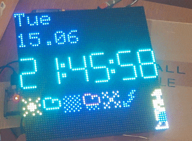

# esp32-morphing-clock
ESP32 HUB75 Matrix Morphing Clock

A clock based on a HUB75 RGB LED matrix, controlled by an ESP32.

<!--  -->

So far, it does the following:
* Displays the current date, time, and day of the week
* Updates the time on startup and periodically, via NTP
* Displays the current outdoor temperature and humidity (received via MQTT - if you want to use this, you will need an MQTT server and a separate temperature sensor publishing to it!)
* Displays the current light levels, read via a TSL2591 I2C light sensor
* Displays the weather forecast for current day (including min/max temperatures), and for the next 4 days
* Can receive OTA updates, triggered via an MQTT message (of course, this also requires an MQTT server :) )
* Display alerts on-screen (received via MQTT)
  mosquitto_pub -h MQTT_HOST -p 1234 -u user -P pass --cafile CA.pem --cert mqtt_client.crt --key mqtt_client.key -t esp32-morphclock/message/send -m "Hallo Welt"

This is very much a work in progress, and it is far from being finished. Things that are planned for the future include:
* Use the current light levels to control the matrix brightness
* Use the buzzer module to get the user's attention when an alert comes in
* Displaying the weather forecast (min/max temperature, weather icons) pulled from Accuweather. The icons are already in place, I just need to pull and parse the JSON...
* Make buzzer tone configureable (on/off/tone)
* allow (log) scrolling messages on display
  checkout: ScrollingTextMatrixTelegram
* get tiny font *if not already available here!??) from eg. MorphingClockRemix github

You can find the "components" for the project here:
* The full source code is [here](code/)  - requires PlatformIO!
* The schematics for the PCB used is [here](pcb/)
* The drawings for the lasercut plexiglass enclosure are [here](case/)

## getting weather updates/forecast
### openweathermap (requires api key)
Since I already had api keys on openweathermap I tried this first. It also seems to allow a decent amount of requests in the free account (60 calls/minute and/or 1,000,000 calls/month).

#### 5 day / 3 hour forecast

the forecast endpoint gives a five day weather forecast for the specified location with a resolution of 3 hours. Given a 24h day we have eight forecasts per day and with five days openweathermap returns a list with about 40 entries. So that's a fair amount of data. To get started lets focus on only one forecast per day (eg. the time around noon for each of the days returned). Each forcasts provides things like temperature, humidity, pressure, wind, clounds ... but also an weather-condition-code and a respective icon (icon file name). so to get an rough overview of the upcoming days we could start showing an icon (those contained in weather.cpp) per day that matches that condition code.

Maybe it would be possible to get the icon directly from openweather (fetch png file and convert it??), that way it does not need to be stored ... not sure if its a good idea? icons are on this page: https://openweathermap.org/weather-conditions

#### url

https://api.openweathermap.org/data/2.5/forecast?q=Boeblingen,de&units=metric&&appid=API_KEY

The query string could contain cnt=N param to limit output list, but cnt=2 would mean get +3 and +6 hour forcast for today, looks there is no 'one-item-per-day' filter in the api.

We use ArduinJson to parse the response as a stream directly after submitting the api request. Some ArduinoJson filtering is applied to further reduce the returned data.

## Issues
* the "middle" row of the clock digigts is somehow "mirrowed" at the top row, so it is slightly visible but not very bight.

## Changelog

### Version 0.2
* Added MQTT SSL support (thanks to [Andreas](https://github.com/lefty01)). Disabled by default, since I do not use it when testing
* Implemented weather forecast - clock now displays min/max temperature for today, today's + next 4 days' forecast icons
* Decreased light sensor read interval (interval is now configurable from config.h)
* Added a watchdog timer to automatically reset the unit (sometimes the main thread seems to hang, possibly due to the light sensor read?)

## Thanks

This project would not have been possible without the work of many others, who have been gracious enough to open source their work. Some of the things that I have used when building this:
* The MQTT SSL code contributed by [Andreas](https://github.com/lefty01)
* The PxMatrix library from [2dom](https://github.com/2dom/PxMatrix). Even though this is NOT used in this project (I switched to the DMA library below, for performance reasons), it is the library that got me started on working with HUB75 matrices.
* The ESP32 DMA library for controlling the matrix, from [mrfaptastic](https://github.com/mrfaptastic/ESP32-HUB75-MatrixPanel-I2S-DMA)
* The morphing clock code from [HariFun](https://www.instructables.com/Morphing-Digital-Clock/) (modified to work with mrfaptastic's library instead of pxmatrix)
* The shield schematics from [hallard](https://github.com/hallard/WeMos-Matrix-Shield-DMA), which gave me the confidence to try building my own version of a shield PCB :)

And, of course, all the authors of the various open source libraries (there are already too many to mention :) ).

I also have to mention here [Brian Lough's work](https://www.tindie.com/products/brianlough/esp32-i2s-matrix-shield/) on a shield for the matrix. Even though he decided not to open source the board (he only sells the finished board on tindie), he has been extremely helpful during my initial work on the project. So if you are looking for a simple option for getting the full kit (shield and components, all in one package), take a look at [his tindie page](https://www.tindie.com/products/brianlough/esp32-matrix-shield-mini-32/) .

## License

The ESP32 HUB75 Matrix Morphing Clock is (c) [Bogdan Sass](https://github.com/bogd), licensed with GNU General Public License Version 3.0 (which means, if you use it in a product somewhere, you need to make the source and all your modifications available to the receiver of such product so that they have the freedom to adapt and improve).
